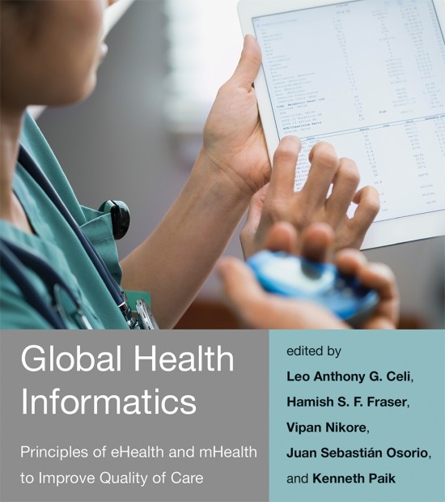

---
categories: ["Books"]
people: ["Kenneth Paik", "Leo Anthony Celi", "Hamish Fraser", "Vipan Nikore", "Juan Sebastian Osorio"]
title: "Textbook: Global Health Informatics"
linkTitle: "Textbook: Global Health Informatics, 2017"
date: 2017-04-01
description: >
  Principles of eHealth and mHealth to Improve Quality of Care.
resources:
  - src: "**.{png,jpg}"
    title: "Image #:counter"
    params:
      byline: "MIT Press"
---

Key concepts, frameworks, examples, and lessons learned in designing and implementing health information and communication technology systems in the developing world.

## Summary

The widespread usage of mobile phones that bring computational power and data to our fingertips has enabled new models for tracking and battling disease. The developing world in particular has become a proving ground for innovation in eHealth (using communication and technology tools in healthcare) and mHealth (using the affordances of mobile technology in eHealth systems). In this book, experts from a variety of disciplines—among them computer science, medicine, public health, policy, and business—discuss key concepts, frameworks, examples, and lessons learned in designing and implementing digital health systems in the developing world.

The contributors consider such topics as global health disparities and quality of care; aligning eHealth strategies with government policy; the role of monitoring and evaluation in improving care; databases, patient registries, and electronic health records; the lifecycle of a digital health system project; software project management; privacy and security; and evaluating health technology systems.

<a href="https://mitpress.mit.edu/books/global-health-informatics" target="_blank">Published by MIT Press</a>

Edited by _(Listed Alphabetically)_:
>    **MIT Sana**
>    - Leo Anthony Celi
> - Hamish S. Fraser
> - Vipan Nikore
> - Juan Sebastián Osorio
> - Kenneth E. Paik

